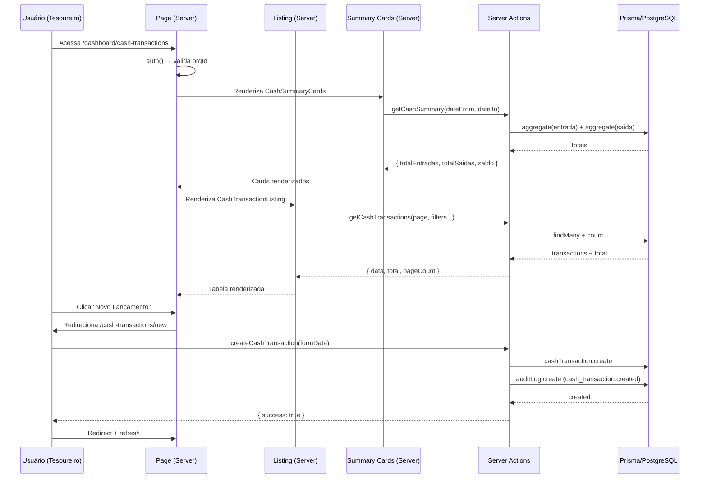

I have created the following plan after thorough exploration and analysis of the codebase. Follow the below plan verbatim. Trust the files and references. Do not re-verify what's written in the plan. Explore only when absolutely necessary. First implement all the proposed file changes and then I'll review all the changes together at the end.

# Plano de Implementação — Caixa Geral (Parte 3.1)

## Observações sobre o Codebase

O modelo `CashTransaction` **já existe** no Prisma schema com todos os campos necessários (`type`, `category`, `description`, `amount`, `transactionDate`, `relatedMemberId`, `relatedPaymentId`, `createdBy`), assim como o enum `CashTransactionType` (`entrada`/`saida`). Não há necessidade de migration. O projeto segue um padrão consistente: schemas Zod em `schemas/`, server actions em `server/`, tabelas com `columns.tsx` + `cell-action.tsx` + `index.tsx` via TanStack Table, formulários com `react-hook-form` + `zodResolver`, páginas com `PageContainer` e `Suspense`, e navegação RBAC em `nav-config.ts`.

## Abordagem

Replicar fielmente os padrões existentes de `charges` e `payments` para criar a feature `cash-transactions`. A estrutura segue: schema Zod → server actions → componentes de tabela → formulário → listing → páginas App Router. Os cards de resumo financeiro são adicionados como componente separado consumindo uma server action `getCashSummary`. Toda a feature é integrada na navegação e searchparams existentes.

---

## Etapas de Implementação

### 1. Schema Zod — `file:src/features/cash-transactions/schemas/cash-transaction.schema.ts`

Criar o schema de validação seguindo o padrão de `file:src/features/payments/schemas/payment.schema.ts`:

- Campo `type` como `z.enum(['entrada', 'saida'])` com mensagem de erro em português
- Campo `category` como `z.string().min(1, 'Informe a categoria')`
- Campo `description` como `z.string().optional()`
- Campo `amount` como `z.number().positive('O valor deve ser maior que zero')`
- Campo `transactionDate` como `z.string().min(1, 'Informe a data da transação')`
- Campos opcionais `relatedMemberId` e `relatedPaymentId` como `z.string().optional()`
- Exportar o type `CashTransactionFormValues` via `z.infer`

---

### 2. Server Actions — `file:src/features/cash-transactions/server/cash-transaction.actions.ts`

Criar seguindo o padrão de `file:src/features/charges/server/charge.actions.ts`:

**`getCashTransactions(page, perPage, search?, type?, category?, dateFrom?, dateTo?)`**
- Usar `auth()` do Clerk para obter `orgId`, validar que existe
- Construir `where: Prisma.CashTransactionWhereInput` com filtros condicionais:
  - `type` → filtro direto no enum
  - `category` → `contains` com `mode: 'insensitive'`
  - `search` → `OR` em `description` e `category`
  - `dateFrom`/`dateTo` → `transactionDate: { gte, lte }` convertendo para `Date`
- `findMany` com `skip/take`, `orderBy: { transactionDate: 'desc' }`, incluir `relatedPayment` opcionalmente
- `count` para total
- Formatar datas com `.toISOString()` e amounts com `Number()` para serialização
- Retornar `{ success, data, total, pageCount }`

**`createCashTransaction(data: CashTransactionFormValues)`**
- `auth()` para obter `userId`, validar
- Validar dados com `cashTransactionSchema.parse(data)`
- `prisma.cashTransaction.create` com `transactionDate: new Date(...)`, `createdBy: userId`
- Registrar auditoria com `prisma.auditLog.create`:
  - `action: 'cash_transaction.created'`
  - `entityType: 'cash_transaction'`
  - `entityId: transaction.id`
  - Usar mesmo padrão de `isMember` check de `charge.actions.ts`
- `revalidatePath('/dashboard/cash-transactions')`
- Retornar `{ success, data }`

**`getCashSummary(dateFrom?, dateTo?)`**
- `auth()` para validar
- Construir filtro de período para `transactionDate`
- Duas queries agregadas com `prisma.cashTransaction.aggregate`:
  - Filtrar `type: 'entrada'` → `_sum: { amount: true }` → `totalEntradas`
  - Filtrar `type: 'saida'` → `_sum: { amount: true }` → `totalSaidas`
- Calcular `saldo = totalEntradas - totalSaidas`
- Retornar `{ success, data: { totalEntradas, totalSaidas, saldo } }`

---

### 3. Search Params — `file:src/lib/searchparams.ts`

Adicionar os seguintes parsers ao objeto `searchParams` existente:

- `transactionType: parseAsString` (para filtro de tipo entrada/saida)
- `category: parseAsString` (para filtro de categoria)
- `dateFrom: parseAsString` (para início do período)
- `dateTo: parseAsString` (para fim do período)

> **Nota:** os nomes `transactionType` (não `type`) evita conflito com palavras reservadas e mantém clareza.

---

### 4. Tabela — `file:src/features/cash-transactions/components/cash-transaction-tables/`

Criar 3 arquivos seguindo o padrão de `file:src/features/charges/components/charge-tables/`:

**`columns.tsx`**
- Definir type `CashTransactionSerializable` com: `id`, `type`, `category`, `description`, `amount`, `transactionDate`, `relatedMemberId`, `relatedPaymentId`, `createdAt`
- Colunas:
  - **Data** (`transactionDate`) — formatada com `date-fns` `format(date, 'dd/MM/yyyy')`
  - **Tipo** (`type`) — `Badge` colorido: `entrada` → `default`, `saida` → `destructive`
  - **Categoria** (`category`) — texto simples
  - **Descrição** (`description`) — texto truncado
  - **Valor** (`amount`) — `Intl.NumberFormat('pt-BR', { style: 'currency', currency: 'BRL' })`
  - **Ações** (`actions`) — renderizar `CellAction`
- Usar `DataTableColumnHeader` de `@/components/ui/table/data-table-column-header`
- Adicionar filtro `multiSelect` no campo tipo com opções `Entrada`/`Saída`

**`cell-action.tsx`**
- DropdownMenu com opção "Visualizar" (para detalhes futuros)
- Sem ação de cancelamento neste MVP — manter simples
- Seguir padrão de `file:src/features/charges/components/charge-tables/cell-action.tsx`

**`index.tsx`**
- Componente `CashTransactionsTable` recebendo `data: CashTransactionSerializable[]` e `totalItems: number`
- Usar `useDataTable` de `@/hooks/use-data-table` com as `columns`
- Renderizar `DataTable` com `DataTableToolbar`
- Seguir padrão exato de `file:src/features/charges/components/charge-tables/index.tsx`

---

### 5. Cards de Resumo — `file:src/features/cash-transactions/components/cash-summary-cards.tsx`

- Componente server-side (`async function CashSummaryCards`)
- Receber props `dateFrom?` e `dateTo?` para filtrar por período
- Chamar `getCashSummary(dateFrom, dateTo)` internamente
- Renderizar 3 cards usando `Card`/`CardContent` de `@/components/ui/card`:
  - **Total Entradas** — ícone verde, valor formatado em BRL
  - **Total Saídas** — ícone vermelho, valor formatado em BRL
  - **Saldo do Período** — ícone azul, valor formatado com cor condicional (positivo=verde, negativo=vermelho)
- Usar ícones do `@tabler/icons-react` (`IconTrendingUp`, `IconTrendingDown`, `IconScale`)
- Layout em grid `grid-cols-1 md:grid-cols-3 gap-4`

---

### 6. Listing — `file:src/features/cash-transactions/components/cash-transaction-listing.tsx`

Seguir o padrão de `file:src/features/charges/components/charge-listing.tsx`:

- Server component `async function CashTransactionListing()`
- Usar `searchParamsCache.get()` para extrair: `page`, `perPage`, `transactionType`, `category`, `dateFrom`, `dateTo`, `name` (para search)
- Chamar `getCashTransactions()` com os parâmetros obtidos
- Renderizar `<CashTransactionsTable data={data} totalItems={total} />`

---

### 7. Formulário — `file:src/features/cash-transactions/components/cash-transaction-form.tsx`

Seguir o padrão de `file:src/features/payments/components/payment-form.tsx`:

- `'use client'` component
- `useForm<CashTransactionFormValues>` com `zodResolver(cashTransactionSchema)`
- Defaults: `type: ''`, `category: ''`, `transactionDate: new Date().toISOString().split('T')[0]`, `amount: 0`, `description: ''`
- Campos do formulário:
  - **Tipo** — `Select` com opções "Entrada" e "Saída"
  - **Categoria** — `Input` texto (ex: placeholder "Aluguel, Materiais, Doação...")
  - **Data da Transação** — `Input type='date'` com ícone `IconCalendarEvent`
  - **Valor** — `Input type='number'` com step 0.01
  - **Descrição** — `Textarea` opcional
- `onSubmit` chamando `createCashTransaction(data)` com feedback via `toast` (sonner)
- Redirect para `/dashboard/cash-transactions` após sucesso
- Botão "Voltar" no cabeçalho com `IconArrowLeft`
- Layout com `Card` + `CardContent` como nos formulários existentes

---

### 8. Páginas App Router

**`file:src/app/dashboard/cash-transactions/page.tsx`**
- Seguir padrão de `file:src/app/dashboard/charges/page.tsx`
- `auth()` → validar `orgId`, senão redirect
- Exportar `metadata: { title: 'Dashboard: Caixa Geral' }`
- Parsear `searchParams` com `searchParamsCache.parse()`
- Usar `PageContainer` com:
  - `pageTitle='Caixa Geral'`
  - `pageDescription='Registre entradas e saídas financeiras da loja.'`
  - `pageHeaderAction` → Link para `/dashboard/cash-transactions/new` com botão "Novo Lançamento"
- Renderizar `<CashSummaryCards />` no topo (passando `dateFrom`/`dateTo` do searchParams)
- Renderizar `<CashTransactionListing />` dentro de `<Suspense fallback={<DataTableSkeleton />}>`

**`file:src/app/dashboard/cash-transactions/new/page.tsx`**
- Seguir padrão de `file:src/app/dashboard/payments/new/page.tsx`
- `auth()` → validar `orgId`
- Exportar `metadata: { title: 'Dashboard: Novo Lançamento de Caixa' }`
- Renderizar `<CashTransactionForm />` dentro de `PageContainer` com `scrollable={true}`
- Este formulário não precisa carregar dados do servidor (diferente de payments que carrega membros)

---

### 9. Ícone — `file:src/components/icons.tsx`

- Adicionar import de `IconCash` do `@tabler/icons-react`
- Adicionar entrada no objeto `Icons`: `cashRegister: IconCash`

> `IconCashBanknote` já está importado e usado como `charges`. `IconCash` é um ícone distinto adequado para o caixa geral.

---

### 10. Navegação — `file:src/config/nav-config.ts`

Adicionar novo item no array `navItems`, posicionado **após** o item "Pagamentos":

- `title: 'Caixa Geral'`
- `url: '/dashboard/cash-transactions'`
- `icon: 'cashRegister'`
- `isActive: false`
- `shortcut: ['c', 'x']`
- `items: []`
- `access: { requireOrg: true, excludeRole: 'org:member' }`

---

## Estrutura Final de Arquivos

```
src/features/cash-transactions/
├── schemas/
│   └── cash-transaction.schema.ts
├── server/
│   └── cash-transaction.actions.ts
└── components/
    ├── cash-transaction-form.tsx
    ├── cash-transaction-listing.tsx
    ├── cash-summary-cards.tsx
    └── cash-transaction-tables/
        ├── columns.tsx
        ├── cell-action.tsx
        └── index.tsx

src/app/dashboard/cash-transactions/
├── page.tsx
└── new/
    └── page.tsx
```

## Fluxo de Dados



## Arquivos Modificados (existentes)

| Arquivo | Alteração |
|---------|-----------|
| `file:src/components/icons.tsx` | Importar `IconCash`, adicionar `cashRegister` ao objeto |
| `file:src/config/nav-config.ts` | Adicionar item "Caixa Geral" após "Pagamentos" |
| `file:src/lib/searchparams.ts` | Adicionar `transactionType`, `category`, `dateFrom`, `dateTo` |