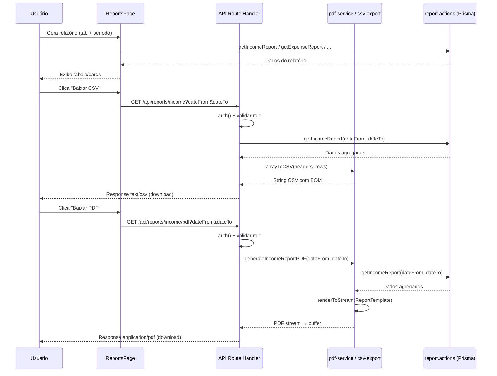

I have created the following plan after thorough exploration and analysis of the codebase. Follow the below plan verbatim. Trust the files and references. Do not re-verify what's written in the plan. Explore only when absolutely necessary. First implement all the proposed file changes and then I'll review all the changes together at the end.

## Observações

O projeto já possui `@react-pdf/renderer` (v4.3.2) e `recharts` instalados. A estrutura de PDF já está consolidada em `file:src/features/reports/server/pdf-service.tsx` com padrão de `renderToStream` + buffer. A única rota de API existente é `file:src/app/api/members/[id]/extrato/route.ts`, que serve como referência sólida para autenticação, geração de PDF e response headers. Os dados dos relatórios são obtidos pelas server actions de `file:src/features/reports/server/report.actions.ts`, que já retornam shapes bem definidos. O componente `file:src/features/reports/components/reports-page.tsx` é client-side e já gerencia estados e tabs.

## Abordagem

Criar o utilitário CSV como função pura em `file:src/features/reports/server/csv-export.ts`. Criar um template React-PDF genérico para relatórios tabulares reutilizando os estilos de `statement-template.tsx`. Estender `pdf-service.tsx` com 3 novas funções de geração de PDF. Criar 6 route handlers em `src/app/api/reports/` (3 CSV + 3 PDF) seguindo exatamente o padrão da rota `extrato`. Por fim, adicionar botões de download no `reports-page.tsx` condicionados à existência de dados carregados.

---

## Passo 1 — Utilitário de exportação CSV

**Arquivo:** `file:src/features/reports/server/csv-export.ts`

Criar uma função utilitária `arrayToCSV` que:
- Receba `headers: { key: string; label: string }[]` e `rows: Record<string, unknown>[]`
- Gere uma string CSV com separador `;` (padrão pt-BR / Excel)
- Prefixe a string com BOM UTF-8 (`\uFEFF`) para garantir compatibilidade com Excel em português
- Formate valores numéricos com `toFixed(2)` e substitua `.` por `,` (formato brasileiro)
- Escape campos que contenham `;`, `"` ou quebras de linha envolvendo-os em aspas duplas

Criar também uma função auxiliar `csvResponse(csvContent: string, filename: string)` que retorne um `NextResponse` com:
- `Content-Type: text/csv; charset=utf-8`
- `Content-Disposition: attachment; filename="${filename}"`

---

## Passo 2 — Template genérico de PDF para relatórios

**Arquivo:** `file:src/features/reports/components/pdf/report-template.tsx`

Criar um componente React-PDF genérico `ReportTemplate` reutilizando a mesma estrutura visual de `file:src/features/reports/components/pdf/statement-template.tsx`:

- **Props:** `{ title: string; subtitle?: string; columns: { key: string; label: string; align?: 'left' | 'right' | 'center'; width: string }[]; rows: Record<string, string | number>[]; summary?: { label: string; value: string }[]; generatedAt: string }`
- **Estilos:** Reaproveitar o `StyleSheet.create` de `statement-template.tsx` — mesmos estilos para `page`, `header`, `brandName`, `reportTitle`, `tableRow`, `tableHeader`, `footer`
- **Layout:** Header com "UPJ Control" + título do relatório, tabela dinâmica baseada nas `columns`, seção opcional de resumo (`summary`), footer com paginação
- Usar as funções `formatCurrency` e `formatDate` do mesmo padrão existente

---

## Passo 3 — Funções de geração de PDF no service

**Arquivo:** `file:src/features/reports/server/pdf-service.tsx`

Adicionar 3 novas funções exportadas, seguindo o mesmo padrão de `generateMemberStatementPDF`:

### `generateIncomeReportPDF(dateFrom?: string, dateTo?: string)`
- Chamar `getIncomeReport(dateFrom, dateTo)` de `report.actions.ts`
- Montar `rows` combinando `paymentEntries` e `cashEntries`
- Columns: "Origem", "Total (R$)"
- Summary: "Total Geral"
- Renderizar `ReportTemplate` com título "Relatório de Entradas"
- Retornar stream via `renderToStream`

### `generateExpenseReportPDF(dateFrom?: string, dateTo?: string)`
- Chamar `getExpenseReport(dateFrom, dateTo)`
- Columns: "Categoria", "Total (R$)"
- Summary: "Total Geral"
- Renderizar com título "Relatório de Saídas"

### `generateConsolidatedPDF(dateFrom?: string, dateTo?: string)`
- Chamar `getConsolidatedBalance(dateFrom, dateTo)`
- Montar como tabela de 3 linhas: "Total Entradas", "Total Saídas", "Saldo"
- Columns: "Descrição", "Valor (R$)"
- Renderizar com título "Balanço Consolidado"

> **Importante:** Importar o novo `ReportTemplate` de `../components/pdf/report-template`. Cada função deve validar `result.success` e lançar erro caso falhe.

---

## Passo 4 — Route handlers CSV

Criar 3 rotas GET seguindo exatamente o padrão de autenticação de `file:src/app/api/members/[id]/extrato/route.ts`:

### 4.1 `file:src/app/api/reports/income/route.ts`
- Importar `auth` do Clerk, validar `orgId` e `orgRole` (rejeitar `org:member`)
- Ler `dateFrom` e `dateTo` dos `searchParams`
- Chamar `getIncomeReport(dateFrom, dateTo)` diretamente
- Montar CSV com headers: "Tipo", "Origem", "Total (R$)"
  - Rows de `paymentEntries` com tipo "Pagamento" + rows de `cashEntries` com tipo "Caixa"
- Usar `csvResponse()` do utilitário com filename `relatorio-entradas-{dateFrom}-{dateTo}.csv`

### 4.2 `file:src/app/api/reports/expenses/route.ts`
- Mesma autenticação
- Chamar `getExpenseReport(dateFrom, dateTo)`
- CSV headers: "Categoria", "Total (R$)"
- Filename: `relatorio-saidas-{dateFrom}-{dateTo}.csv`

### 4.3 `file:src/app/api/reports/member-position/route.ts`
- Mesma autenticação
- Chamar `getMemberFinancialPosition(dateFrom, dateTo)`
- CSV headers: "Membro", "Total Cobrado", "Total Pago", "Saldo"
- Filename: `posicao-membros-{dateFrom}-{dateTo}.csv`

---

## Passo 5 — Route handlers PDF

Criar 3 rotas GET com mesmo padrão de autenticação e response do `extrato/route.ts` (stream → buffer → `NextResponse` com `application/pdf`):

### 5.1 `file:src/app/api/reports/income/pdf/route.ts`
- Autenticar e validar role
- Ler `dateFrom`/`dateTo` dos searchParams
- Chamar `generateIncomeReportPDF(dateFrom, dateTo)` do `pdf-service.tsx`
- Converter stream em buffer (mesmo padrão `chunks` da rota `extrato`)
- Retornar com `Content-Type: application/pdf` e `Content-Disposition: attachment; filename="relatorio-entradas.pdf"`

### 5.2 `file:src/app/api/reports/expenses/pdf/route.ts`
- Mesma estrutura, chamar `generateExpenseReportPDF`
- Filename: `relatorio-saidas.pdf`

### 5.3 `file:src/app/api/reports/consolidated/pdf/route.ts`
- Mesma estrutura, chamar `generateConsolidatedPDF`
- Filename: `balanco-consolidado.pdf`

---

## Passo 6 — Botões de download no `reports-page.tsx`

**Arquivo:** `file:src/features/reports/components/reports-page.tsx`

Modificar o componente para adicionar botões de exportação:

1. Importar `IconDownload` e `IconFileTypePdf` de `@tabler/icons-react` (já disponível no projeto)
2. Criar uma função helper `buildDownloadUrl(basePath: string): string` que monta a URL com query params `?dateFrom=${dateFrom}&dateTo=${dateTo}`
3. Em cada `TabsContent`, quando houver dados carregados (ex: `incomeData`, `expenseData`, etc.), renderizar uma `div` com dois botões usando o componente `Button` (variant `outline`, size `sm`):

| Tab | Botão CSV | Botão PDF |
|---|---|---|
| `income` | `/api/reports/income?dateFrom=...&dateTo=...` | `/api/reports/income/pdf?dateFrom=...&dateTo=...` |
| `expenses` | `/api/reports/expenses?dateFrom=...&dateTo=...` | `/api/reports/expenses/pdf?dateFrom=...&dateTo=...` |
| `balance` | _(sem CSV)_ | `/api/reports/consolidated/pdf?dateFrom=...&dateTo=...` |
| `member-position` | `/api/reports/member-position?dateFrom=...&dateTo=...` | _(sem PDF)_ |
| `by-charge-type` | _(sem exportação)_ | _(sem exportação)_ |

4. Os botões devem ser links (`<a>`) wrapados com `Button` usando `asChild`, com `target="_blank"` e `download` para forçar o download
5. Posicionar a barra de botões entre o indicador de período e o conteúdo da tab, visível apenas quando dados estão carregados



---

## Estrutura final de arquivos criados/modificados

```
src/
├── features/reports/
│   ├── server/
│   │   ├── csv-export.ts                    ← NOVO (Passo 1)
│   │   └── pdf-service.tsx                  ← MODIFICADO (Passo 3)
│   └── components/
│       ├── pdf/
│       │   └── report-template.tsx           ← NOVO (Passo 2)
│       └── reports-page.tsx                  ← MODIFICADO (Passo 6)
├── app/api/reports/
│   ├── income/
│   │   ├── route.ts                          ← NOVO (Passo 4.1)
│   │   └── pdf/
│   │       └── route.ts                      ← NOVO (Passo 5.1)
│   ├── expenses/
│   │   ├── route.ts                          ← NOVO (Passo 4.2)
│   │   └── pdf/
│   │       └── route.ts                      ← NOVO (Passo 5.2)
│   ├── member-position/
│   │   └── route.ts                          ← NOVO (Passo 4.3)
│   └── consolidated/
│       └── pdf/
│           └── route.ts                      ← NOVO (Passo 5.3)
```