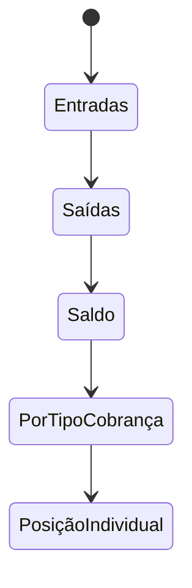

I have created the following plan after thorough exploration and analysis of the codebase. Follow the below plan verbatim. Trust the files and references. Do not re-verify what's written in the plan. Explore only when absolutely necessary. First implement all the proposed file changes and then I'll review all the changes together at the end.

## Observações

O projeto já possui a infraestrutura necessária: `recharts` instalado (usado em `file:src/features/overview/components/bar-graph.tsx`), componentes shadcn `Tabs`, `Calendar`, `Popover`, `Card` e `Chart` disponíveis, `date-fns` instalado, e o padrão de server actions bem definido em `file:src/features/cash-transactions/server/cash-transaction.actions.ts`. O modelo `CashTransaction` tem enum `entrada/saida`, e as relações `Payment → PaymentAllocation → Charge → ChargeType` estão no schema Prisma. O controle de acesso no projeto usa checagem direta de `orgRole` (e não `has()`), excluindo `org:member`.

## Abordagem

Criar o módulo `reports` seguindo a mesma arquitetura feature-based do projeto. O backend terá um único arquivo `report.actions.ts` com 5 server actions usando queries Prisma agregadas. O frontend será uma página com tabs client-side (`'use client'`), onde cada tab busca dados via server action ao clicar em "Gerar", mantendo estado local com `useState`. Isso evita complexidade de searchparams por tab e se alinha melhor à natureza de relatórios sob demanda.

---

## Passo 1 — Server Actions (`report.actions.ts`)

Criar `file:src/features/reports/server/report.actions.ts` com a diretiva `'use server'`.

Importar `prisma` de `@/lib/db`, `auth` de `@clerk/nextjs/server` e `Prisma` de `@prisma/client`.

Criar um helper privado `assertReportAccess()` que chama `await auth()`, valida que `orgId` existe e que `orgRole !== 'org:member'`, retornando `{ userId, orgId }`. Seguir o mesmo padrão de guarda usado em `getCashTransactions` de `file:src/features/cash-transactions/server/cash-transaction.actions.ts`.

Criar um helper privado `buildDateFilter(dateFrom?: string, dateTo?: string)` que retorna um objeto `{ gte?, lte? }` para filtros de data, reutilizando a mesma lógica de `getCashSummary`.

### 1.1 — `getIncomeReport(dateFrom?: string, dateTo?: string)`

Retorna entradas agrupadas por fonte. Deve executar duas queries em paralelo com `Promise.all`:

1. **Pagamentos recebidos**: Usar `prisma.payment.groupBy` agrupando por `paymentMethod`, filtrando `paymentDate` pelo período. Somando `amount` via `_sum`. Mapear resultados para `{ source: paymentMethod, total }`.

2. **Caixa entradas**: Usar `prisma.cashTransaction.groupBy` agrupando por `category`, filtrando `type: 'entrada'` e `transactionDate` pelo período. Somando `amount` via `_sum`. Mapear resultados para `{ source: category, total }`.

Retornar `{ success: true, data: { paymentEntries, cashEntries, grandTotal } }` onde `grandTotal` é a soma de todos os totais. Converter todos os `Decimal` para `Number`.

### 1.2 — `getExpenseReport(dateFrom?: string, dateTo?: string)`

Usar `prisma.cashTransaction.groupBy` agrupando por `category`, filtrando `type: 'saida'` e `transactionDate` pelo período. Somar `amount` via `_sum`.

Retornar `{ success: true, data: { expenses: [{ category, total }], grandTotal } }`.

### 1.3 — `getConsolidatedBalance(dateFrom?: string, dateTo?: string)`

Executar 3 queries agregadas em paralelo:
1. `prisma.payment.aggregate` → `_sum.amount` (total de pagamentos recebidos no período)
2. `prisma.cashTransaction.aggregate` → `_sum.amount` onde `type: 'entrada'` (entradas avulsas do caixa)
3. `prisma.cashTransaction.aggregate` → `_sum.amount` onde `type: 'saida'` (saídas do caixa)

Calcular:
- `totalEntradas` = soma de pagamentos + entradas avulsas do caixa
- `totalSaidas` = saídas do caixa
- `saldo` = totalEntradas − totalSaidas

Retornar `{ success: true, data: { totalEntradas, totalSaidas, saldo } }`.

### 1.4 — `getReceiptsByChargeType(dateFrom?: string, dateTo?: string)`

Usar `prisma.paymentAllocation.findMany` com `include` de `charge.chargeType` e `payment`, filtrando `payment.paymentDate` pelo período. Depois, agrupar programaticamente os resultados por `charge.chargeType.name`, somando `allocatedAmount`.

Retornar `{ success: true, data: [{ chargeTypeName, total, count }] }`.

**Alternativa SQL**: Se preferir performance, usar `prisma.$queryRaw` com SQL direto fazendo JOIN entre `payment_allocations`, `charges`, `charge_types` e `payments`, agrupando por `charge_types.name`.

### 1.5 — `getMemberFinancialPosition(dateFrom?: string, dateTo?: string)`

Buscar todos os membros ativos com `prisma.member.findMany` onde `status: 'ativo'`, incluindo:
- `charges` com filtro de `competenceDate` pelo período → selecionar `amount` e `status`
- `payments` com filtro de `paymentDate` pelo período → selecionar `amount`

Para cada membro, calcular:
- `totalCharged` = soma dos `charge.amount` (excluindo `status: 'cancelada'`)
- `totalPaid` = soma dos `payment.amount`
- `balance` = `totalCharged - totalPaid` (positivo = devendo, negativo = crédito)

Retornar `{ success: true, data: [{ memberId, memberName, totalCharged, totalPaid, balance }] }` ordenado por `balance` descendente (maiores devedores primeiro).

---

## Passo 2 — Ícone e Navegação

### 2.1 — Adicionar ícone em `file:src/components/icons.tsx`

Importar `IconReportAnalytics` de `@tabler/icons-react` e adicionar a entrada `reports: IconReportAnalytics` no objeto `Icons`.

### 2.2 — Adicionar item na navegação em `file:src/config/nav-config.ts`

Adicionar após o item "Caixa Geral":

| Propriedade | Valor |
|---|---|
| `title` | `'Relatórios'` |
| `url` | `'/dashboard/reports'` |
| `icon` | `'reports'` |
| `isActive` | `false` |
| `shortcut` | `['r', 'l']` |
| `items` | `[]` |
| `access` | `{ requireOrg: true, excludeRole: 'org:member' }` |

---

## Passo 3 — Componente de Filtros (`report-filters.tsx`)

Criar `file:src/features/reports/components/report-filters.tsx` como componente `'use client'`.

**Props**: `onFilter: (dateFrom: string, dateTo: string) => void`, `isLoading?: boolean`.

**Estrutura**:
- Dois inputs `<Input type="date" />` (data inicial e data final), usando o mesmo padrão do `file:src/features/cash-transactions/components/cash-transaction-form.tsx` com o ícone `IconCalendarEvent`.
- Inicializar `dateFrom` com o primeiro dia do mês atual e `dateTo` com a data de hoje (usar `date-fns` já instalado: `startOfMonth`, `format`).
- Um `<Button>` "Gerar Relatório" que chama `onFilter(dateFrom, dateTo)`.
- Layout horizontal com `flex items-end gap-4`.

---

## Passo 4 — Componentes de Exibição de Dados

### 4.1 — `consolidated-balance-card.tsx`

Criar `file:src/features/reports/components/consolidated-balance-card.tsx`.

**Props**: `data: { totalEntradas: number, totalSaidas: number, saldo: number }`.

Reutilizar a mesma estrutura de `file:src/features/cash-transactions/components/cash-summary-cards.tsx` — 3 cards horizontais com ícones `IconTrendingUp`, `IconTrendingDown`, `IconScale` de `@tabler/icons-react`, usando `Card` e `CardContent` de `@/components/ui/card`. Esse componente é client-side (recebe dados via props, sem fetch próprio).

### 4.2 — `income-report-table.tsx`

Criar `file:src/features/reports/components/income-report-table.tsx`.

**Props**: `data: { paymentEntries, cashEntries, grandTotal }`.

Renderizar duas seções:
1. **Recebimentos (Pagamentos)** — tabela simples (`<table>`) com colunas: "Método de Pagamento" e "Total (R$)". Usar classes de tabela do Tailwind com `border`, `text-right`, etc.
2. **Entradas Avulsas (Caixa)** — tabela com colunas: "Categoria" e "Total (R$)".
3. **Rodapé** com `grandTotal` em destaque.

Usar `Intl.NumberFormat('pt-BR', { style: 'currency', currency: 'BRL' })` para formatar valores.

### 4.3 — `expense-report-table.tsx`

Criar `file:src/features/reports/components/expense-report-table.tsx`.

**Props**: `data: { expenses, grandTotal }`.

Tabela com colunas: "Categoria" e "Total (R$)", com rodapé mostrando `grandTotal`.

### 4.4 — `member-position-table.tsx`

Criar `file:src/features/reports/components/member-position-table.tsx`.

**Props**: `data: Array<{ memberId, memberName, totalCharged, totalPaid, balance }>`.

Tabela com colunas: "Membro", "Total Cobrado", "Total Pago", "Saldo". Colorir a coluna saldo em vermelho se positivo (devendo) e verde se negativo/zero (em dia/crédito).

### 4.5 — `receipts-by-type-chart.tsx`

Criar `file:src/features/reports/components/receipts-by-type-chart.tsx` como `'use client'`.

**Props**: `data: Array<{ chargeTypeName: string, total: number }>`.

Seguir exatamente o padrão de `file:src/features/overview/components/bar-graph.tsx`:
- Usar `ChartContainer` e `ChartConfig` de `@/components/ui/chart`
- Usar `BarChart`, `Bar`, `XAxis`, `YAxis` de `recharts`
- Usar `ChartTooltip` + `ChartTooltipContent` para tooltips
- Envolver em `Card` com `CardHeader` (título "Recebimentos por Tipo de Cobrança") e `CardContent`
- Cada barra representando um `chargeTypeName`, com altura proporcional ao `total`
- Configurar `chartConfig` com cores usando variáveis CSS `var(--chart-1)`, etc.

---

## Passo 5 — Componente Principal (`reports-page.tsx`)

Criar `file:src/features/reports/components/reports-page.tsx` como componente `'use client'`.

**Estrutura**:



- Importar `Tabs`, `TabsList`, `TabsTrigger`, `TabsContent` de `@/components/ui/tabs`.
- Gerenciar estado local com `useState`:
  - `activeTab` — tab corrente
  - `dateFrom`, `dateTo` — filtros de período
  - `isLoading` — indicador de carregamento
  - Um estado para cada conjunto de dados: `incomeData`, `expenseData`, `balanceData`, `receiptsByTypeData`, `memberPositionData`
- Renderizar `<ReportFilters>` acima das tabs (compartilhado por todas).
- Ao clicar "Gerar", chamar a server action correspondente à tab ativa, atualizar o estado e renderizar o componente de exibição correspondente.

**Tabs**:

| Tab Value | Label | Server Action | Componente |
|---|---|---|---|
| `income` | Entradas | `getIncomeReport` | `<IncomeReportTable>` |
| `expenses` | Saídas | `getExpenseReport` | `<ExpenseReportTable>` |
| `balance` | Saldo | `getConsolidatedBalance` | `<ConsolidatedBalanceCard>` |
| `by-charge-type` | Por Tipo de Cobrança | `getReceiptsByChargeType` | `<ReceiptsByTypeChart>` |
| `member-position` | Posição Individual | `getMemberFinancialPosition` | `<MemberPositionTable>` |

- Quando o usuário troca de tab, limpar os dados do estado anterior e mostrar um placeholder convidando a clicar "Gerar".
- Enquanto `isLoading`, mostrar um spinner (usar `Icons.spinner` com classe `animate-spin`).

---

## Passo 6 — Rota App Router

Criar `file:src/app/dashboard/reports/page.tsx`.

**Estrutura** — seguir o mesmo padrão de `file:src/app/dashboard/cash-transactions/page.tsx`:
1. Exportar `metadata` com `title: 'Dashboard: Relatórios'`.
2. Chamar `await auth()` e validar `orgId` (redirect para `/dashboard/workspaces` se ausente).
3. Se `orgRole === 'org:member'`, chamar `resolveDashboardLanding` e redirecionar.
4. Envolver em `<PageContainer>` com `scrollable={true}`, `pageTitle="Relatórios Financeiros"`, `pageDescription="Visualize relatórios consolidados de entradas, saídas e posição financeira."`.
5. Renderizar `<ReportsPage />` dentro do container.

---

## Resumo da Estrutura de Arquivos

```
src/features/reports/
├── server/
│   ├── report.actions.ts          ← NOVO (5 server actions)
│   └── pdf-service.tsx            ← existente (não modificar)
├── components/
│   ├── reports-page.tsx           ← NOVO (componente principal com tabs)
│   ├── report-filters.tsx         ← NOVO (filtros de data)
│   ├── consolidated-balance-card.tsx ← NOVO
│   ├── income-report-table.tsx    ← NOVO
│   ├── expense-report-table.tsx   ← NOVO
│   ├── member-position-table.tsx  ← NOVO
│   ├── receipts-by-type-chart.tsx ← NOVO
│   └── pdf/                       ← existente (não modificar)

src/app/dashboard/reports/
└── page.tsx                       ← NOVO

src/components/icons.tsx           ← MODIFICAR (adicionar reports)
src/config/nav-config.ts           ← MODIFICAR (adicionar item)
```