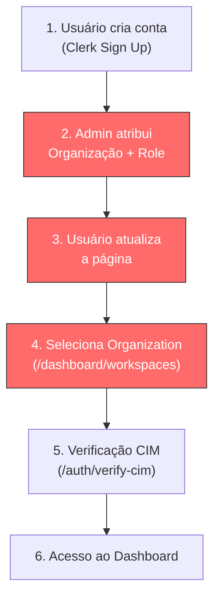
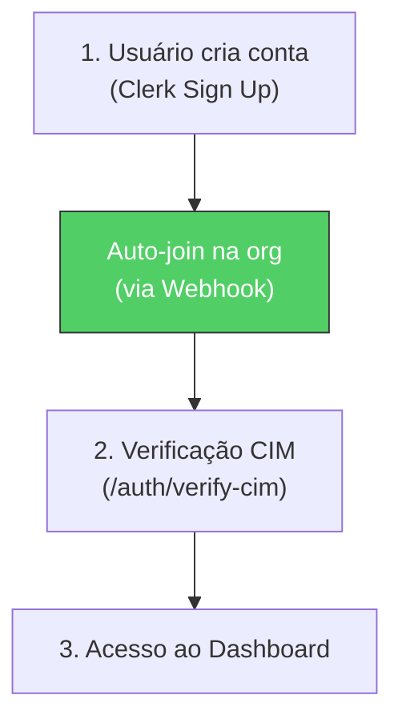

# Simplificação do Fluxo de Autenticação — Organização Única

## Problema Atual

O fluxo de onboarding atual tem **5 etapas manuais** e depende de intervenção do admin:



> [!WARNING]
> Os passos 2, 3 e 4 são gargalos desnecessários para um sistema single-org. O admin precisa intervir manualmente para cada novo usuário, e o usuário precisa saber que deve atualizar a página e selecionar a organização.

---

## Fluxo Proposto (Simplificado)



**De 6 etapas → 3 etapas (sendo 1 automática)**

---

## Estratégia: Webhook `user.created` do Clerk

A ideia central é usar um **Webhook do Clerk** que dispara quando um novo usuário é criado. Esse webhook automaticamente:

1. **Adiciona o usuário à organização única** com a role `org:member`
2. O usuário **já entra logado com org ativa** — sem precisar selecionar nada

### Como funciona

```
Clerk (user.created) 
  → POST /api/webhooks/clerk
    → clerkClient.organizations.addMember({ orgId: ORG_ID, userId, role: 'org:member' })
```

---

## Proposta de Mudanças

### 1. API Route — Webhook Clerk

#### [NEW] [route.ts](file:///Users/lazarolima/development/bode/UPJ/src/app/api/webhooks/clerk/route.ts)

Nova rota que recebe o evento `user.created` do Clerk e automaticamente adiciona o usuário à organização padrão.

- Usa o pacote `svix` para verificar a assinatura do webhook (segurança)
- Lê o `CLERK_ORG_ID` do `.env.local` (ID da organização única)
- Chama `clerkClient().organizations.createOrganizationMembership()` com role `org:member`

```typescript
// Pseudocódigo da lógica principal
export async function POST(req: Request) {
  // 1. Verificar assinatura Svix (segurança)
  // 2. Parsear o payload
  // 3. Se evento === 'user.created':
  //    - Adicionar userId à org fixa com role 'org:member'
  //    - Setar a org como ativa no Clerk para o usuário
}
```

### 2. Variáveis de Ambiente

#### [MODIFY] [.env.local](file:///Users/lazarolima/development/bode/UPJ/.env.local)

Adicionar:
```env
# ID da organização única (obtido no Clerk Dashboard → Organizations)
CLERK_ORG_ID=org_xxxxxxxxxxxxx

# Webhook secret (obtido ao criar o webhook no Clerk Dashboard)
CLERK_WEBHOOK_SECRET=whsec_xxxxxxxxxxxxx
```

### 3. Simplificar Redirects (sem `workspaces`)

#### [MODIFY] [landing.ts](file:///Users/lazarolima/development/bode/UPJ/src/lib/auth/landing.ts)

- Remover o fallback para `/dashboard/workspaces` (linha 76) — não faz sentido em single-org
- Trocar por redirect para `/auth/verify-cim` ou `/dashboard/overview` conforme o caso

#### [MODIFY] Todas as pages que fazem `if (!orgId) redirect('/dashboard/workspaces')`

Trocar de:
```typescript
if (!orgId) redirect('/dashboard/workspaces');
```
Para:
```typescript
if (!orgId) redirect('/auth/sign-in');
```

> [!IMPORTANT]  
> Isso afeta **~10 arquivos** que checam `orgId`. Com o webhook, o `orgId` sempre existirá para usuários autenticados, então esse check se torna apenas uma proteção de edge case.

**Arquivos afetados:**
- `src/app/dashboard/charges/page.tsx`
- `src/app/dashboard/charges/[id]/page.tsx`
- `src/app/dashboard/charges/new/page.tsx`
- `src/app/dashboard/payments/page.tsx`
- `src/app/dashboard/payments/[id]/page.tsx`
- `src/app/dashboard/payments/new/page.tsx`
- `src/app/dashboard/cash-transactions/page.tsx`
- `src/app/dashboard/cash-transactions/new/page.tsx`
- `src/app/dashboard/members/[memberId]/statement/page.tsx`
- `src/app/dashboard/reports/page.tsx`
- `src/app/dashboard/audit-logs/page.tsx`

### 4. Remover/Simplificar página de Workspaces

#### Decisão: Manter ou remover `/dashboard/workspaces`?

**Opção A — Remover completamente**: Deletar a página e todas as referências
**Opção B — Manter como "config da org"**: Manter mas remover o selector de organização, usar apenas para gerenciar membros da org

> [!IMPORTANT]
> **Qual opção prefere?** Se você não precisa gerenciar membros da org via UI (faz pelo Clerk Dashboard), a Opção A é mais limpa.

### 5. Configuração no Clerk Dashboard

Além do código, precisa configurar no **Clerk Dashboard**:

1. **Criar o Webhook**:
   - Ir em **Webhooks** → **Add Endpoint**
   - URL: `https://seu-dominio.com/api/webhooks/clerk`
   - Eventos: marcar `user.created`
   - Copiar o **Signing Secret** para `CLERK_WEBHOOK_SECRET`

2. **Obter org_id**:
   - Ir em **Organizations** → sua organização
   - Copiar o ID (formato `org_xxxx`)

---

## Dependências

```bash
bun add svix  # Para verificação de assinatura do webhook
```

---

## Open Questions

> [!IMPORTANT]
> ### 1. O que fazer com a página de Workspaces?
> - **A)** Remover completamente (recomendado para single-org)
> - **B)** Manter para gerenciamento de membros

> [!IMPORTANT]
> ### 2. Ambiente de desenvolvimento
> Para testar webhooks localmente, você vai precisar de um tunnel (ngrok, cloudflared, etc.) ou pode alternativamente usar a **Clerk CLI** com `clerk dev --proxy-url`. Qual prefere?

> [!IMPORTANT]
> ### 3. Usuários existentes
> Existem usuários já criados no Clerk que ainda **não estão** na organização? Se sim, precisamos de um script de migração para adicioná-los.

---

## Verificação

### Automated Tests
- Testar criação de novo usuário no Clerk → verificar se é adicionado automaticamente à org
- Verificar que o fluxo sign-up → CIM → dashboard funciona sem intervenção manual

### Manual Verification
- Criar um novo usuário pela tela de sign-up
- Confirmar que ele já aparece como membro da org no Clerk Dashboard
- Confirmar que não é redirecionado para `/dashboard/workspaces`
- Confirmar que o fluxo CIM → dashboard continua funcionando
